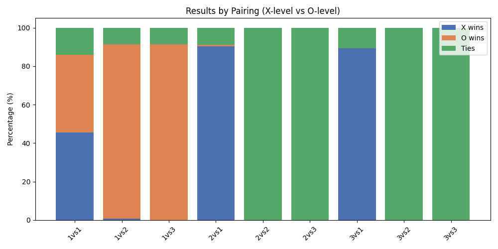
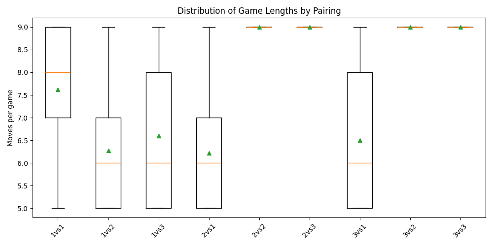

# Tic Tac Toe Project (AI Levels)

We will implement our own AI bots for Tic Tac Toe. The full problem can be found [Here](CPS485_2026_Spring_HW1.pdf)

# Answer(s)

## AI Bots
We have 3 level AI bots. **One** is extremely naive, the next level, **two**, has a heuristic approach with these priorities:
```# Priority:
# 1. Win if possible
# 2. Block opponent's immediate win
# 3. Take center if available
# 4. Prefer corners
# 5. Otherwise pick a random available move
```
And the last AI bot, **three**, uses min-max tree with branch pruning.

*Level 1 + Tic-Tac-Toe - Jacob \
Level 2 - Adithya \
Level 3 - Corbin*

## Results
Results were quite profound. The level 1 bot picked at random, but managed to choose some what optimal positions a few times. You will see this in the plots bellow \
Plots from ran simulations:



The plots show that the Level 1 bot was pretty split down the middle with wins and loses. A few ties also occurred.

With the 1vs2 the level 1 bot manged to scratch out a win. However, most of the time the Level 2 bot won, and it usually did so in fewer moves. This shows that Level 2 is a lot more consistent and is able to take advantage of mistakes that Level 1 makes.

When testing 1vs3, the Level 1 bot almost never won. Most games either ended in a tie or a win for the Level 3 bot. This makes sense since Level 3 is clearly playing more optimally, meaning it blocks more often and avoids throwing away winning positions.

When we tested ourselves against the bots, the Level 1 bot was the easiest and we were able to win. The Level 2 bot won most of the time and was very challenging. The Level 3 bot also won most of the time and was very challenging as well, and it was much harder to beat compared to the other levels.

Overall, as the AI level increased, the results became less random and more consistent, and it became much harder for both the other bots and for us to win against it.